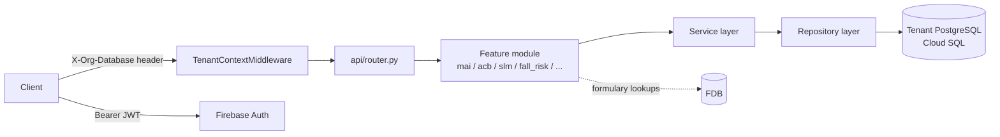

# Architecture Overview

ClaimSync's backend (`mom-backend`) is a multi-tenant FastAPI application that
powers clinical analytics modules — medication appropriateness, anticholinergic
burden, sedative load, fall risk, drug-drug interactions, and more — for PACE
and PaceSemi care programs.

| | |
|---|---|
| **Language / framework** | Python 3.11+, FastAPI (sync endpoints — plain `def`, not `async def`) |
| **ORM** | SQLModel / SQLAlchemy 2.x, sync sessions (no `AsyncSession`) |
| **Auth** | Firebase Authentication + JWT, verified in `webapi/core/security.py` |
| **Infrastructure** | GCP — Cloud SQL (PostgreSQL), Cloud Storage (GCS) |
| **Multi-tenancy** | Per-request tenant DB resolved from the `X-Org-Database` header |

## System context



Every call carries two pieces of context that shape the rest of the request:
an `X-Org-Database` header that selects which tenant database to use, and a
Firebase JWT that identifies the caller. Both are resolved once, early in the
chain, and made available via dependency injection — feature code never reads
either directly.

## Feature-based module structure

Code is organized by **clinical feature module**, not by technical layer. Each
of the 18 modules under `webapi/` (`mai/`, `acb/`, `slm/`, `fall_risk/`,
`reconciliation/`, `ddi/`, and others) is self-contained and follows the same
internal layout:

```
<module>/
├── router.py          # Mounts the v1 router at prefix="/<module>"
└── v1/
    ├── router.py       # Wires sub-routers — pure wiring, no endpoints
    ├── routers/        # Endpoint handlers
    ├── services/       # Business logic
    ├── repositories/   # All DB queries
    ├── models/         # SQLModel ORM table classes
    └── schemas/        # Pydantic request/response models
```

A request flows straight down this stack — endpoint → service → repository →
database — with nothing skipping a layer.

## Dependency rules

```
feature module  →  shared/  →  core/  →  db/
```

| Layer | Can import from | Never imports from |
|---|---|---|
| Feature module (e.g. `mai/`) | `shared/`, `core/`, `db/` | Other feature modules |
| `shared/` | `core/`, `db/` | Any feature module |
| `core/` | `db/` (config only) | Features, `shared/` |
| `api/router.py` | Feature routers only | Services, repositories, models |

!!! note
    If two feature modules need to share code, it moves to `shared/` — modules
    never import from one another directly.

## Multi-tenancy

`TenantContextMiddleware` reads `X-Org-Database` from the request and stores
it on `request.state.tenant_db_name`. The `get_tenant_db()` dependency then
resolves the correct engine from a global, per-tenant cache. Most tenants
connect with a password; a few (e.g. `longevity`) authenticate via Cloud SQL
IAM instead — see the [mom-backend architecture guide](../guides/mom_backend/CLAUDE.md)
for the details of that path.

## Where to go next

- **[mom-backend Architecture Guide](../guides/mom_backend/CLAUDE.md)** — full module reference, request-flow trace, and conventions for adding a new module or API version.
- **[Migration Runner](../guides/mom_backend/MIGRATIONS.md)** — how schema migrations are discovered, applied, and protected from post-hoc edits.
- **[Monthly Report Flow](../guides/ehr_pipeline/monthly_report/monthly_report_flow.md)** — a concrete, worked example of a request moving through this architecture end to end.
- **[Decisions (ADRs)](decisions.md)** — why key architectural choices were made.
