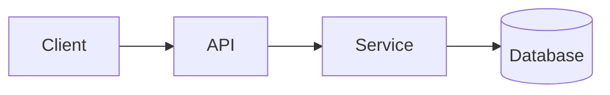

# Architecture Overview

> _Placeholder — replace with the real system overview._

## System context

Describe the major components and how they interact. A diagram helps — Material
supports [Mermaid](https://squidfunk.github.io/mkdocs-material/reference/diagrams/):

## Components

| Component | Responsibility | Repo |
|-----------|----------------|------|
| _TBD_     | _TBD_          | _TBD_ |
